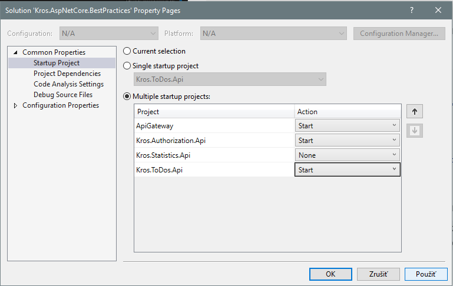
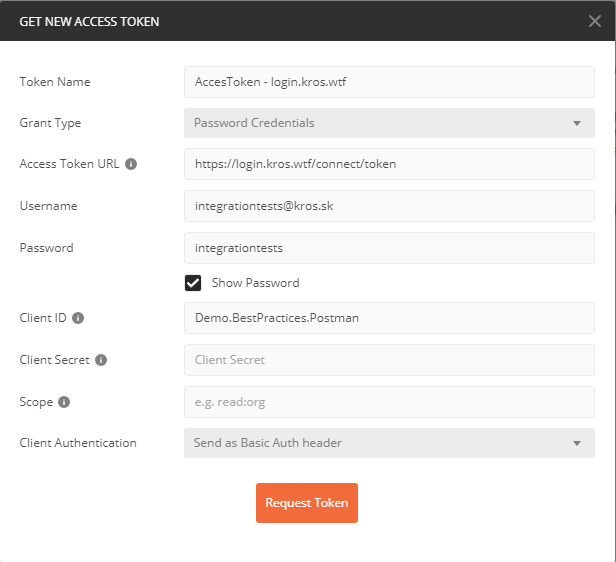

# Kros.AspNetCore.BestPractices

Toto repo **bude** obsahovať demo príklad, ktorý bude ukazovať architektúru našich služieb.

Mal by obsahovať:

- vzorovú štruktúru projektov
- použitie našich knižníc
- použitie odporúčaných externých knižníc
- ukážku architektúry jednotlivých služieb

Na základne tohto dema by mal človek pochopiť architektúru našich služieb a mal by byť schopný vytvoriť nový projekt v podobnom duchu.

- [Kros.AspNetCore.BestPractices](#KrosAspNetCoreBestPractices)
  - [Quick start](#Quick-start)
    - [Stiahnuť projekt](#Stiahnu%C5%A5-projekt)
    - [Vytvoriť potrebné databázy](#Vytvori%C5%A5-potrebn%C3%A9-datab%C3%A1zy)
    - [Nastaviť connection stringy k databázam](#Nastavi%C5%A5-connection-stringy-k-datab%C3%A1zam)
      - [Služba `Kros.Todos.Api`](#Slu%C5%BEba-KrosTodosApi)
      - [Služba `Kros.Authorization.Api`](#Slu%C5%BEba-KrosAuthorizationApi)
      - [Služba `Kros.Organization.Api`](#Slu%C5%BEba-KrosOrganizationApi)
    - [Nastavenie kešovania](#Nastavenie-ke%C5%A1ovania)
    - [Nastavenie spúšťania projektov](#Nastavenie-sp%C3%BA%C5%A1%C5%A5ania-projektov)
    - [Spustiť projekt](#Spusti%C5%A5-projekt)
    - [Získanie OAuth 2.0 tokenu](#Z%C3%ADskanie-OAuth-20-tokenu)
    - [Testovacie nasadenie](#Testovacie-nasadenie)
    - [Klientská Aplikácia](#Klientsk%C3%A1-Aplik%C3%A1cia)
  - [Overview](#Overview)
  - [Project physical structure](#Project-physical-structure)
  - [Microservices internal architecture](#Microservices-internal-architecture)
    - [Prehľad CQRS](#Preh%C4%BEad-CQRS)
    - [CQRS](#CQRS)
  - [Použité knižnice](#Pou%C5%BEit%C3%A9-kni%C5%BEnice)

## Quick start

### Stiahnuť projekt

   `git clone https://github.com/Kros-sk/Kros.AspNetCore.BestPractices.git`

### Vytvoriť potrebné databázy

Tento príklad využíva ako úložisko dát `MS SQL` databázy. Na vašom servri je potrebné vytvoriť dve prázdne databázy. `<ToDos>`, `<Users>` a `<Organization>`.
`<ToDos>` databáza - bude ju používať služba `Kros.Todos.Api`.
`<Users>` databáza - bude ju používať služba `Kros.Authorization.Api`.
`<Organization>` databáza - bude ju používať služba `Kros.Organization.Api`.

### Nastaviť connection stringy k databázam

   Jednotlivé služby používajú na prístup k dátam KORM. Je potrebné im nastaviť connection string na prístup k databázam. Ideálne v `appsettings.local.json`.

#### Služba `Kros.Todos.Api`

```json
  "ConnectionStrings": {
    "DefaultConnection": "Server=servername\\instancename;Initial Catalog=Users;Persist Security Info=False;Integrated Security=True;"
  },

  "KormSettings": {
    "DefaultConnection": {
      "AutoMigrate": true
    }
  },
```

#### Služba `Kros.Authorization.Api`

```json
  "ConnectionStrings": {
    "DefaultConnection": "Server=servername\\instancename;Initial Catalog=Users;Persist Security Info=False;Integrated Security=True;"
  },

   "KormSettings": {
    "DefaultConnection": {
      "AutoMigrate": true
    }
  },
```

#### Služba `Kros.Organization.Api`

```json
  "ConnectionStrings": {
    "DefaultConnection": "Server=servername\\instancename;Initial Catalog=Organization;Persist Security Info=False;Integrated Security=True;"
  },

    "KormSettings": {
    "DefaultConnection": {
      "AutoMigrate": true
    }
  },
  }
```

> `KormMigrations` využíva KORM na spustenie migrácií. Ak máte databázových používateľov s obmedzenými právami, tak v tomto connection stringu musí mať používateľ právo na vytváranie schémy.

### Nastavenie kešovania

Služba ToDos využíva Redis na distribuovanú keš. Pomocou nasledujúcej konfigurácje je možné ju nastaviť:

```json
  "RedisCache": {
    "ConnectionString": "localhost:6379",
    "InstanceName": "local",
    "UseRedis": "true"
  }
```

> Pokiaľ `UseRedis` necháme nastavené na `false`, tak sa nepoužije Redis, ale memory keš.

### Nastavenie spúšťania projektov

Vo VS je potrebné nastaviť, ktoré projekty sa majú spúšťať. Nasledovne:


### Spustiť projekt

Visual Studio `F5`.
Na adrese [http://localhost:9000/swagger](http://localhost:9000/swagger) je dostupná swagger dokumentácia.

> Odporúčam stiahnuť si odtiaľ swagger definíciu jednotlivých služieb a importovať do Postmena.

### Získanie OAuth 2.0 tokenu

Projekt využíva na autentifikáciu identity server 4. A konkrétne na demo účel je napojený na ich demo inštanciu [https://demo.identityserver.io](https://demo.identityserver.io).

Údaje na získanie tokenu:
**Grant type** - Authorization Code
**Callback URL** - v princípe akákoľvek adresa. Napr.: `http://localhost:4200/something`
**Client ID** - spa
**Scope** - `openapi email profile api`

V Postmenovi je možné použiť buť `prerequest script`, alebo priamo okno na získanie tokenu:


### Testovacie nasadenie

Aplikácia je nasadená na AZURE a apigateway je dostupný na adrese [https://demo.todos.gateway.api.kros.wtf/swagger](https://demo.todos.gateway.api.kros.wtf/swagger).

### Klientská Aplikácia

K tomuto projektu existuje aj Angular klientská aplikácia. Nachádza sa na [https://github.com/Kros-sk/Kros.Angular.BestPractices]([https://link](https://github.com/Kros-sk/Kros.Angular.BestPractices))
Demo aplikácia je dostupná na adrese [https://demo.todos.kros.wtf](https://demo.todos.kros.wtf)

## Overview

## Project physical structure

## Microservices internal architecture

Táto sekcia sa venuje tomu ako sú vnútorne organizované služby. Popisuje ich vnútornú architekúru.

Existuje niekoľko spôsobov ako sa k tomu postaviť. Pokiaľ je služba naozaj jednoduchá, zameraná na výkon a nepredpokladáme jej postupné zozložiťovanie, tak môžme využiť `CRUD` prístup a úpne bez starosti priamo v controlleroch *(alebo vo vlastnom routingu, ak je to naozaj kritická služba z pohľadu výkonu)* napísať požadovanú funkčnosť. Samozrejme na to musí by jasný dôvod.

My sme sa rozhodli pre netriviálne služby využiť architektonický návrhový vzor `CQRS` (Command Query Responsibility Segregation).

### Prehľad CQRS

Predstavme si triedu `ToDosService`. Štandardná trieda v prípade, že nechceme písať kód priamo v controlleroch. Takéto triedy obsahujú metódy typu `GetAllToDos()`, `GetToDoById(id)`, `CreateToDo(toDoViewModel)`,... Obsahovala implementáciu všetkej funkčnosti, ktorú očakávame od `ToDos`. Takéto triedy majú tendenciu narastať. Každá zmena si vyžaduje zložité skúmanie ako dané veci fungujú a aký by mohl byť vedľajší účinok týchto zmien. Nehovoriac o tom, že takúto triedu ťažko použijeme na inom mieste ak z nej potrebujeme nejakú funkčnosť.

Vo väčšine prípadov môžme v jednoduchosti hovoriť o dvoch typoch operácií. Operácie, ktoré čítajú dáta a ktoré ich menia. *(čítajú stav a menia stav systému)* Vo väčšine aplikácií (systémov) sú jasné rozdiely medzi operáciami, ktoré čítajú stav (**queries**) a ktoré menia stav (**commands**). Keď čítame dáta, tak zvyčajne nepotrebujeme validovať tieto dáta, alebo nejakú ďalšiu business logiku. Ale často práve potrebujeme kešovať. Model pre čítanie a zápis môže byť (často býva) iný.

### CQRS

Poznámky

- v query nemusí byť repository

## Použité knižnice

- [Kros.KORM](https://github.com/Kros-sk/Kros.KORM) je ORM knižnica pre prístup k MS SQL databázam.
- [Kros.KORM.Extensions.Asp](https://github.com/Kros-sk/Kros.KORM.Extensions.Asp) balíček obshuje rozšírenia KORM-u pre jednoduchšiu integráciu s ASP.NET Core službami. (Registrovanie do DI kontajnera, migrácie, ...)
- [Kros.Utils](https://github.com/Kros-sk/kros.utils) všeobecná knižnica obsahujúca pomôcky pre bežné programovanie v .NET.
- [Scrutor](https://github.com/khellang/Scrutor) umožňuje skenovať `Assembly` a automaticky registrovať služby do DI kontajnera.
- [Mapster](https://github.com/MapsterMapper/Mapster) pre automatické mapovanie entít, DTO, doménových tried, ...
- [MediatR](https://github.com/jbogard/MediatR) knižnica pre in-process komunikáciu. Pomocou tejto knižnice implemnetujeme CQRS pattern vrámci jednej služby.
- [FluentValidation](https://fluentvalidation.net/) používame na validovanie. Každý request v rámci `MediatR` je automaticky validovaný. Validačné pravidlá sa nachádzajú v triedach s postfixom `Validator`.
- [Swashbuckle.AspNetCore](https://github.com/domaindrivendev/Swashbuckle.AspNetCore) knižnica, ktorá automaticky vygeneruje API dokumentáciu pre jednotlivé endpointy.
- [MicroElements.Swashbuckle.FluentValidation](https://github.com/micro-elements/MicroElements.Swashbuckle.FluentValidation) rozšírenie, ktoré validačné pravidla písané cez `FluentValidation` prenesie do swagger dokumentácie.
- [Microsoft.Extensions.Caching.StackExchangeRedis](https://www.nuget.org/packages/Microsoft.Extensions.Caching.StackExchangeRedis) - používame na komunikáciu s `Redis` distribuovanou kešou.
- [Ocelot](https://github.com/ThreeMammals/Ocelot) framework na vytvorenie vlastnej `Api Gateway`. Umožňuje jednoducho vytvoriť proxy, ktorá zastreší presmerovanie na vnútorné služby. Umožňuje ale aj ďalšie veci ako aggregáciu, rate limity, ...
- [Flurl](https://github.com/tmenier/Flurl) fluent URL builder and testable HTTP client for .NET https://flurl.io
